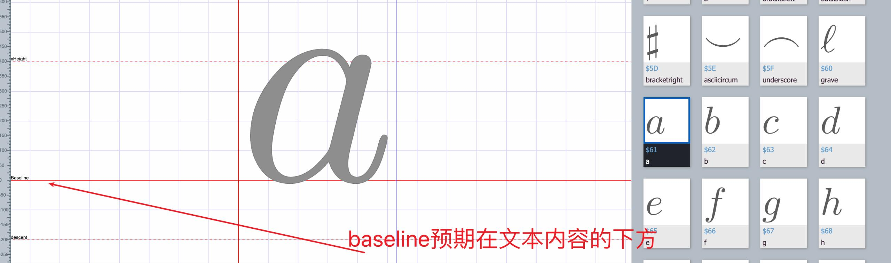
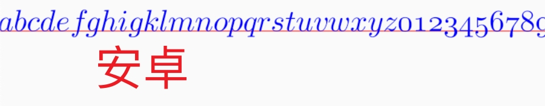
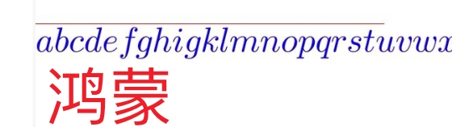
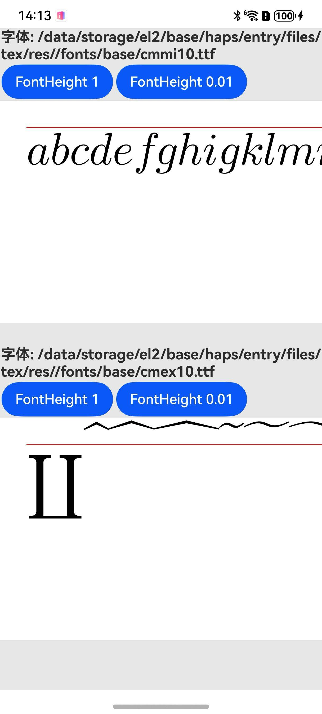
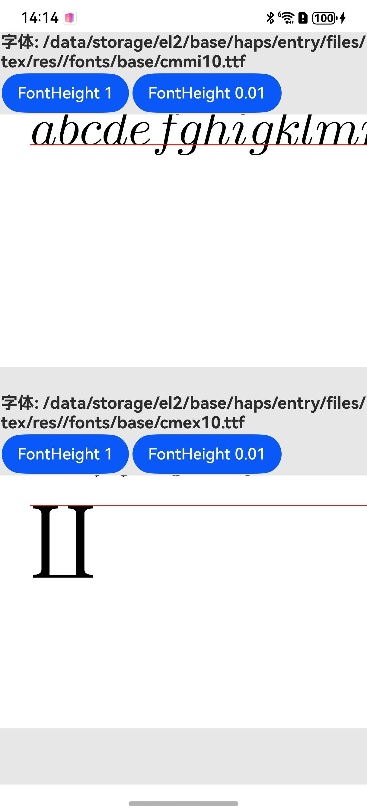
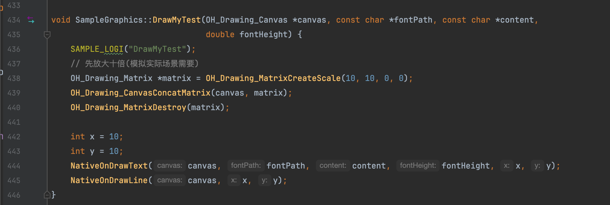
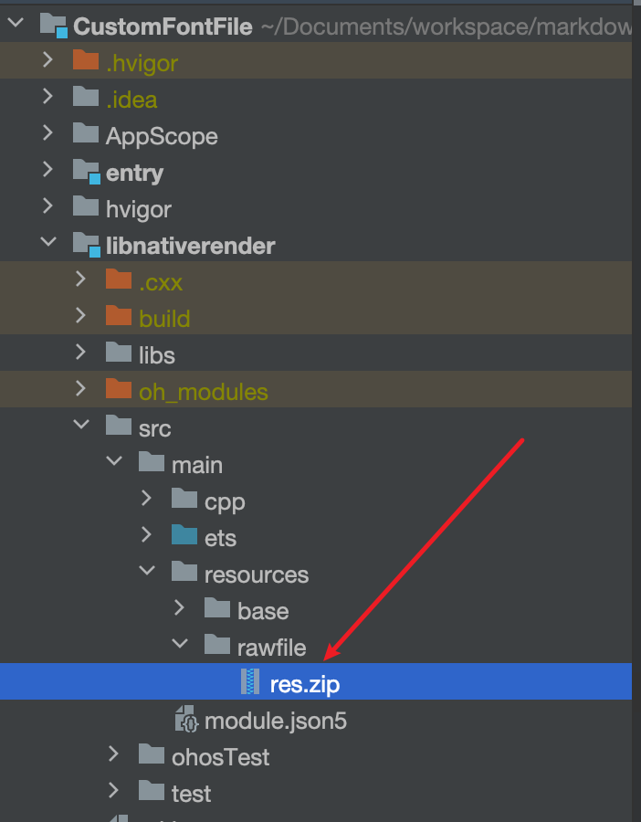
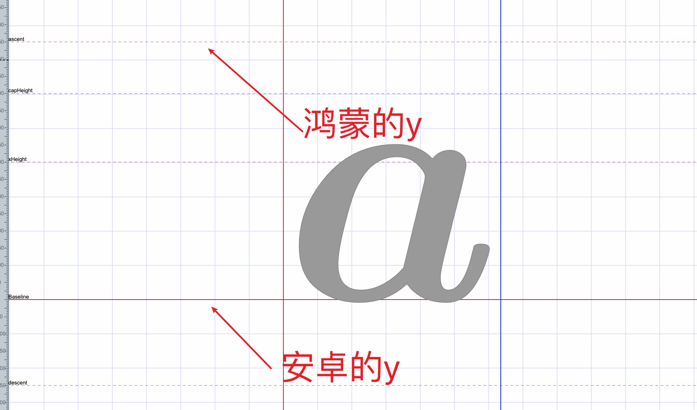

# CustomFontFile Unexpected BaseLine Demo

[TOC]


## 一、背景

做鸿蒙平台的markdown latex公式时，需要导入一些字体.ttf文件。

目前使用的方案是 OH_Drawing_RegisterFont 加载/注册自定义字体：https://github.com/openharmony/docs/blob/d513a1b69a60b369edc38bc12feffa13560f45bc/zh-cn/application-dev/graphics/custom-font-c.md

使用过程中，发现y轴位置（Baseline）不太符合预期。对于不同的.ttf文件，文本内容可能在baseline上方或下方，但是目前看均绘制在了baseline下方。导致部分文本内容在y轴上误往下偏移了。


## 二、bug表现

比如`cmmi10.ttf`这个字体文件。使用 https://font.qqe2.com/ 这个网站导入、编辑该字体，我们可以看到baseline在文字的下方。￵



在安卓平台预览是符合预期的。



但在鸿蒙上，文本内容跑到了y轴的下面。



## 三、已尝试手段

### 1、设置基线 OH_Drawing_SetTextStyleBaseLine

笔者尝试分别设置baseline为enum的两个值，没有肉眼可见的变化。

```C++
typedef enum OH_Drawing_TextBaseline {
    /** Alphabetic, where the letters in alphabets like English sit on. */
    TEXT_BASELINE_ALPHABETIC,
    /** Ideographic. The baseline is at the bottom of the text area. */
    TEXT_BASELINE_IDEOGRAPHIC,
} OH_Drawing_TextBaseline;
```

### 2、查找baseline offset相关代码

只找到了placeholder相关的代码：`OH_Drawing_PlaceholderVerticalAlignment`。

### 3、调整行高

见录屏（assets目录下视频文件）。

在鸿蒙上，当fontHeight为1时，文字跑到了y轴的下面。



当fontHeight设置为0.01时，文字跑到了y轴的上方，“有一些符合预期”了。



## 四、代码位置

*  Native Render 代码见 `sample_graphics.cpp`

函数位置：`libnativerender/src/main/cpp/render/sample_graphics.cpp:434` `SampleGraphics::DrawMyTest`



```c++
static void NativeOnDrawText(OH_Drawing_Canvas *canvas,  const char *fontPath, const char *content, double fontHeight, int x,int y) {
    std::string fontPathStr(fontPath);
    if (fontPathStr.length() <= 0) {
        drawStringWithoutCustomFont(canvas, content, x, y);
        return;
    }

    OH_Drawing_FontCollection *fontCollection = OH_Drawing_CreateFontCollection();
    const char *fontFamily = extractFontFamily(fontPath).c_str();
    int errorCode = OH_Drawing_RegisterFont(fontCollection, fontFamily, fontPath);
    const char *myFontFamilies[] = {fontFamily};

    // 选择从左到右/左对齐等排版属性
    OH_Drawing_TypographyStyle *typoStyle = OH_Drawing_CreateTypographyStyle();
    OH_Drawing_SetTypographyTextDirection(typoStyle, TEXT_DIRECTION_LTR);
    OH_Drawing_SetTypographyTextAlign(typoStyle, TEXT_ALIGN_START);
    OH_Drawing_SetTypographyTextFontFamily(typoStyle, fontFamily);
    OH_Drawing_SetTypographyTextFontHeight(typoStyle, fontHeight);

    OH_Drawing_TextStyle *txtStyle = OH_Drawing_CreateTextStyle();
    OH_Drawing_SetTextStyleColor(txtStyle, OH_Drawing_ColorSetArgb(0xFF, 0x00, 0x00, 0x00));
    OH_Drawing_SetTextStyleFontSize(txtStyle, 17);
    OH_Drawing_SetTextStyleFontWeight(txtStyle, FONT_WEIGHT_100);
    // 修改基线设置为ALPHABETIC，这样可以保持与TextBlob一致的绘制位置
    OH_Drawing_SetTextStyleBaseLine(txtStyle, TEXT_BASELINE_ALPHABETIC);
    // 设置行高为1.0，避免额外的行间距影响
    OH_Drawing_SetTextStyleFontHeight(txtStyle, fontHeight); // 0.01 影响 baseline？
    // 设置字体类型等
    OH_Drawing_SetTextStyleFontFamilies(txtStyle, 1, myFontFamilies);
    OH_Drawing_SetTextStyleFontStyle(txtStyle, FONT_STYLE_NORMAL);
    OH_Drawing_SetTextStyleLocale(txtStyle, "en");
    OH_Drawing_TextStyleSetBaselineShift(txtStyle, 0.0);

    OH_Drawing_TypographyCreate *handler = OH_Drawing_CreateTypographyHandler(typoStyle, fontCollection);
    OH_Drawing_TypographyHandlerPushTextStyle(handler, txtStyle);
    // 设置文字内容
    OH_Drawing_TypographyHandlerAddText(handler, content);
    OH_Drawing_Typography *typography = OH_Drawing_CreateTypography(handler);
    OH_Drawing_TypographyLayout(typography, 10000);
    OH_Drawing_TypographyPaint(typography, canvas, x, y);

    // 销毁创建的资源
    OH_Drawing_DestroyTypography(typography);
    OH_Drawing_DestroyTypographyHandler(handler);
    OH_Drawing_DestroyTextStyle(txtStyle);
    OH_Drawing_DestroyTypographyStyle(typoStyle);
    OH_Drawing_DestroyFontCollection(fontCollection);
}
```


## 五、资源文件

*  .ttf文件在这个压缩包里




## 六、结论与解决方案

自定义.ttf字体文件时，在安卓平台上y为baseline；在鸿蒙平台上y为ascent。可以做一下位置的偏移。

```c++
OH_Drawing_LineMetrics* lineInfo = OH_Drawing_TypographyGetLineMetrics(typography);
OH_Drawing_TypographyPaint(typography, canvas, x, y - lineInfo->ascender);
```


